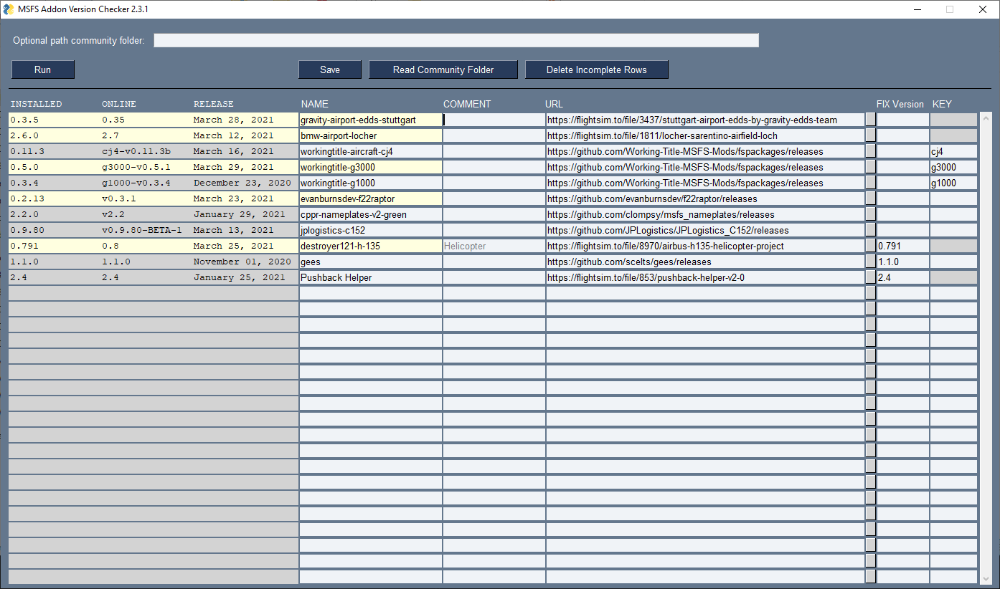

# MSFS Addon Version Checker

### Introduction
This simple application shows the installed versions and online available version of configured addons and tools for the Microsoft Flight Simulator. So it can be used to get an overview whether new versions are available.

Supported sources for addons and tools are:
* flightsim.to
* github.com

### Installation and Execution
[Download the latest released version](https://github.com/Koseng/MSFSAddonVersionChecker/releases/latest). Unpack to a folder and execute checkAddons.exe. To Run the version checks press the Run-Button.

### Configuration
For each addon or tool fill out one line in the table. If you run out of empty lines, save, restart and you get more.
Do not forget to save your configuration with the Save-Button.

* **NAME**: Enter the exact name of the addon folder in your community folder. For a tool just enter the name of the tool.
* **URL**: Enter the url to the flightsim or github page like in the examples.
* **FIX version**: For tools the installed version cannot be auto detected. Therefore enter the version manually. You can also manually enter an installed version for addons. That can be useful if the addon maker does not properly update its version information.
* **KEY**: For github you can optionally add an additional version key. That is necessary if an addon maker does release different addons in the the same github repository like Working-Title.

#### Community Folder
If your addon versions are note detected - "Unavailable", you might have a non standard community folder. In that case sdd your community folder in the input box at the top.

### Development information
#### Execute Python Script
If you want to run the python script directly:
* Install [Python](https://www.python.org/downloads/). On Installation check box for Path inclusion.
* Install additional libraries via command shell:
    * `pip install httpx`
    * `pip install beautifulsoup4`
    * `pip install pysimplegui`
    * `pip install pyinstaller`
* Now switch to the directory and you can run the python script via `python checkAddons.py`. Also it is possible to create a batch file like checkAddons.bat which contains `python checkAddons.py`.

#### Build Executable
Comment out os.chdir(sys.path[0]) in checkAddons.py. Then run createExecutable.bat.

